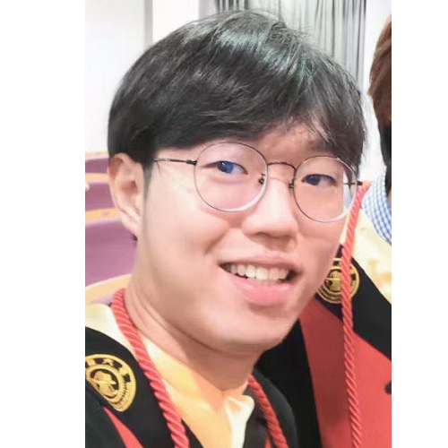

## About Me

I am a Master's student in Biomedical Engineering and Computer Science at [Carnegie Mellon University](https://www.cmu.edu/), advised by [Prof. Howie Choset](https://www.ri.cmu.edu/ri-faculty/howie-choset/) in the [Biorobotics Lab](https://www.ri.cmu.edu/robotics-groups/biorobotics/).

Before joining CMU, I obtained a bachelor’s degree from the [IEEE Honor Class](https://english.seiee.sjtu.edu.cn/english/info/8338.htm) at [Shanghai Jiao Tong University](https://en.sjtu.edu.cn/), advised by [Prof. Bingbing Ni](https://scholar.google.com/citations?user=eUbmKwYAAAAJ).

## Research Interest

Medical image analysis, 3D computer vision, machine learning, and medical robotics.

## Publications

- #### RibSeg Dataset and Strong Point Cloud Baselines for Rib Segmentation from CT Scans. 

  Jiancheng Yang *, **Shixuan Gu**\*, Donglai Wei, Hanspeter Pfister, and Bingbing Ni.

  *International Conference on Medical Image Computing and Computer-Assisted Intervention (MICCAI), 2021.*

  [[publication]](https://link.springer.com/chapter/10.1007/978-3-030-87193-2_58) [[code]](https://github.com/M3DV/RibSeg) [[dataset]](https://zenodo.org/record/5336592)

## Honors

- #### **[2021] Biomedical Engineering Department Head’s Fellowship**

  College of Engineering, Carnegie Mellon University

- #### [2021] Outstanding Graduate of Shanghai Jiao Tong University

  Shanghai Jiao Tong University

- #### [2019] VEX U Skills Challenge World Champion, VEX U Division Champion

  2019 VEX U Robotics World Championship, Robotics Education & Competition Foundation

- #### [2018] VEX Robotics Create Award, Robot Skills Finalist, Silver Award

  12th Asia-Pacific Robotics Championship, Asian Robotics League

- #### [2018] Student Ambassador, Excellent Student Presentation Award

  Student Learning Festival of C9+1 Symposium, Hong Kong University

- #### [2016] First Prize, Best Con in Shanghai Young Physicists' Tournament (SYPT)

  Shanghai Physical Society, China

## Misc.

- #### *Teaching Assistant*: Artificial Intelligence and Data Science (COM SCI - 960.01: Aug'21), Research Methodologies (ENGL 902: Aug'21), Academic Writing (ENGL 901: Aug'21)

  UCLA Extension, University of California, Los Angeles

- #### *Programming*: Python, Pytorch, scikit-learn, C++, Javascript, HTML, PHP

- #### *Tool*s: Anaconda, TensorFlow, CyberTorcs, MySQL, LaTeX

  

<i>"Do not go gentle into that good night."</i>

 — Dylan Thomas

